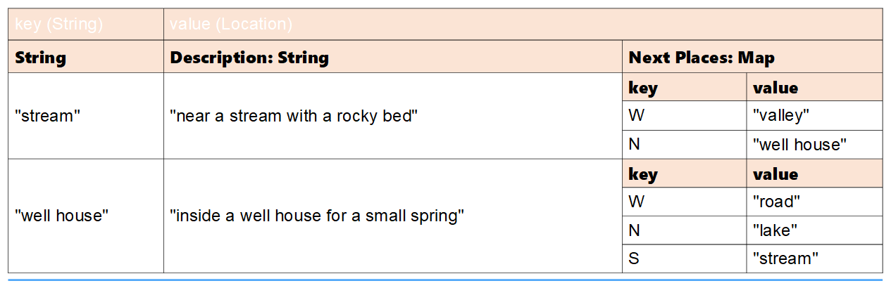
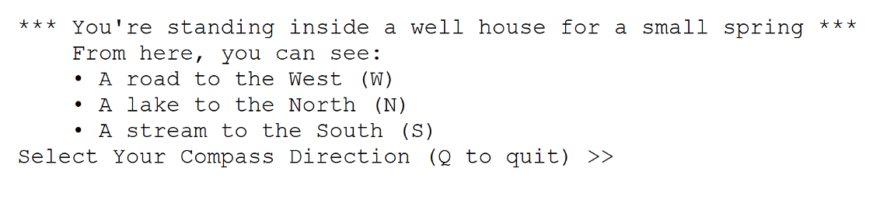

#  Java Maps

### Proje Kurulumu

Projeyi öncelikle forklayın ve clone edin.
Daha sonra projeyi IntellijIDEA kullanarak açınız. README.md dosyasını dikkatli bir şekilde okuyarak istenenleri yapmaya çalışın.
Proje sayımız ilerledikçe proje yönetimimizi kolaylaştırmak adına projelerimizi belli klasör kalıplarında saklamak işimizi kolaylaştırmak adına iyi bir alışkanlıktır.
Örnek bir Lokasyon: Workintech/Sprint_1/Etud.

### Hedeflerimiz:

### Adventure Game

 * Amacımız HashMap kullanarak text tabanlı bir macera oyunu yazmak.
 * Oyunumuz aşağıdaki haritayı baz alarak oynanmaktadır.
 * 
 * Oyun senaryosunda kullanıcı(user) haritanın ortasında ve ```Road``` kısmında olucak şekilde oyuna başlar.
 *  ```North``` kullanıcıyı ```Forest``` yönüne götürecek.
 *  ```South``` kullanıcıyı ```Valley``` yönüne götürecek.
 *  ```East``` kullanıcıyı ```Well House``` yönüne götürecek.
 *  ```West``` kullanıcıyı ```Hill``` yönüne götürecek.
 * Bu çalışmada 2 adet HashMap kullanmalıyız. Bir tanesi şuan ki konumu tutmak için. Bir diğeri gidilebilecek olan alanları tutmak için.
 
 * Verinin nasıl gösterileceği ve tutulacağı aşağıdaki resimde gösterilmeye çalışılmıştır.
 * 
 *  ```Location``` isimli bir sınıfımız olmalı 3 tane değişkeni olmalı. ```field```, ```description```  ve ```nextPlaces``` => HashMap olmalı ve gidilebilecek diğer alanları tutmalı.
 * Aşağıda Location sınıfı için bir örnek verilmiştir.
 * 

 * Console kullanarak kullanıcıya bulunduğu lokasyonu tanımlamaya çalışın ve bu noktadan nerelere gidebileceğini göstermelisiniz.
 * Bir prompt ile kullancıdan gidebileceği lokasyonu almalısınız.
 * Kullanıcı ```Q``` harfina basarsa oyun durmalı bu işlem olana kadar kullanıcı oyunda istediği kadar gezebilir.
 * Aşağıdaki resimde örnek bir console cıktısı paylaşılmıştır.
 * 
  
